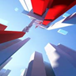
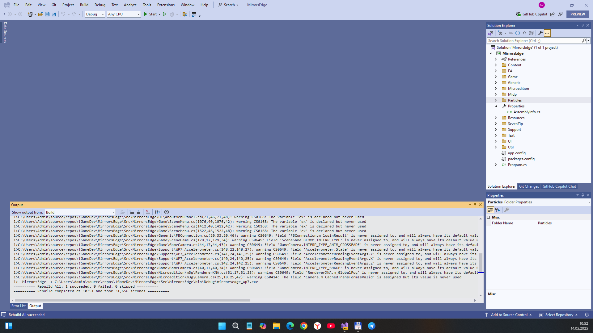

# Mirror's Edge pre-alpha - net48 branch 

## Status
- Game framework ("engine"): MonoGame 3.8 DX
- NET 4.8 used
- Project sucessfully builded 
- Game run failed

## ToDo
- Fix game run
- Do some cool game mods / tweaks

## Reference(s)
- https://www.ea.com/games/mirrors-edge/ Electronic Arts site :: Mirror's Edge section 
- https://soundcloud.com/user249000542/lisa-miskovsky-still-alive-the-theme-from-mirrors-edge Sound Cloud :: Lisa Miskovsky - Still Alive (music theme from Mirror's Edge)

## .
As is. No support. Research purposes only. DIY.

## ..
[m][e] May 2025

