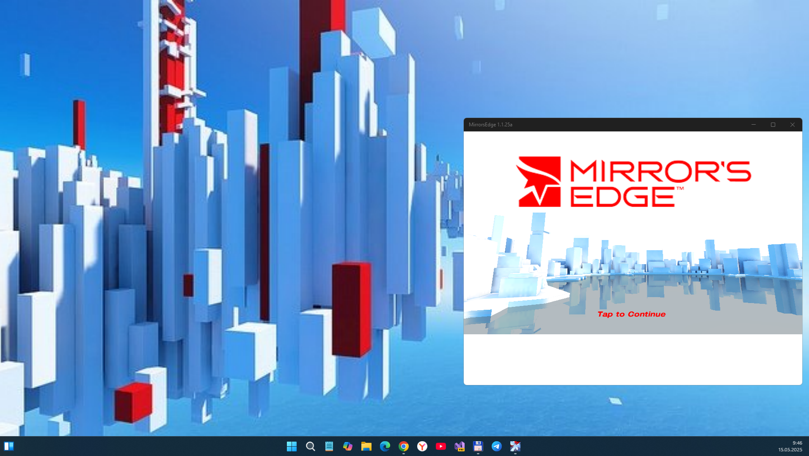

# Mirror's Edge 1.1.25-alpha - master branch 

Planned "UWP-remake" of Mirror's Edge game project. 

## Screenshot

## Tech. details
- App type: UWP
- Win SDK build: 19041
- Min. Win SDK build: 10240

## Status
- Work-in-progress
- Draft UWP app as result of initital reversed-code research (early bird -- not for game run!)
- Min. Win. SDK = 10240, and Win. SDK 19041 used
- Alpha state, 100500 bugs still here (but binary game data not decoded, and screen scaling problems not fixed)
- No music, no sound (soundmanager not fixed)
- No Russian (ru) text support (sprite font problem?), only English (en) text resource seems to be ok... 

## ToDo
- Refresh intro music for 2025 ... some remix needed :)
- Fix bugs to normal game run
- Extend Input manager (kbd, mouse, and touchscreen or joystick)
- Fix localization
- Fix screen scaling
- Check game data & settings save/store

## Reference(s)
- https://www.ea.com/games/mirrors-edge/ Electronic Arts site :: Mirror's Edge section 
- https://soundcloud.com/user249000542/lisa-miskovsky-still-alive-the-theme-from-mirrors-edge Sound Cloud :: Lisa Miskovsky - Still Alive (music theme from Mirror's Edge)

## .
As is. No support. Research purposes only. DIY.

## ..
[m][e] May 2025

