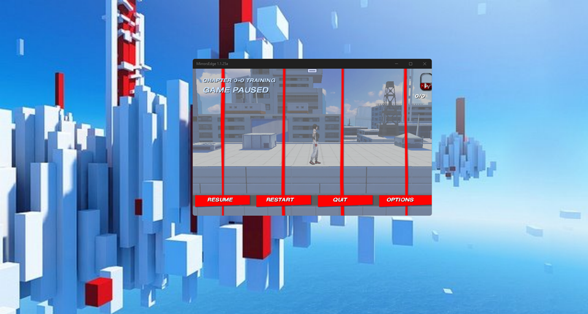

# Mirror's Edge 1.1.25-alpha - uwp branch 

Planned "UWP-remake" of Mirror's Edge game project. However, is just cool dev research project. No less, no more.

## Screenshot

## Tech. details
- App type: UWP
- Win SDK build: 19041
- Min. Win SDK build: 10240

## Status
- Work-in-progress: game opntions & game start fixed (?), but some screen object distortions (scaling problems/bugs) detected!
- Draft UWP app as result of initial reversed-code research (early bird -- not for game run!)
- Min. Win. SDK = 10240, and Win. SDK 19041 used
- Alpha state, 100500 bugs still here (but binary game data not decoded, and screen scaling problems not fixed)
- Music theme refresh (StillAlive-2025 based on Mirror's Edge - Still Alive-1 by Cookieluver31)
- No Russian (ru) text support (sprite font problem?), only English (en) text resource seems to be ok... 
- No accelerometer emulation on "desktop pcs"... so, player moving disabled...  ;( 

## ToDo
- Fix player movements (via accelerometer or mouse "right-click and hold + move".... idk!)
- Continue fixing screen scaling errors
- Fix proper resources reading
- Fix localization (en-US as default, also ru, ch, ...)
- Check game data & settings save/store
- Emulate some achievements (?)

## Reference(s)
- https://www.ea.com/games/mirrors-edge/ Electronic Arts site :: Mirror's Edge section 
- https://soundcloud.com/cookieluver31/mirrors-edge-still-alive-1 Sound Cloud :: Mirror's Edge - Still Alive(1) by Cookieluver31 

## .
As is. No support. Research purposes only. DIY.

## ..
[m][e] May 2025

